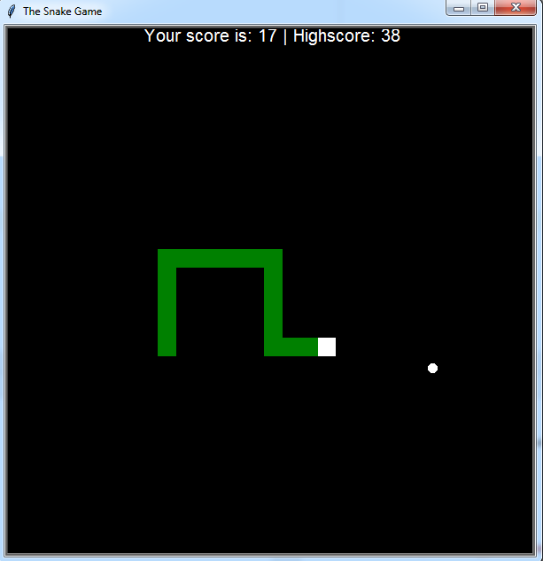

# Snake Game in Python

Classic Snake game implemented in Python using Turtle graphics.
   

## How to Play

- Use the arrow keys to control the snake.
- Eat the food to grow the snake.
- Avoid colliding with the walls or the snake's own body.

## Features

- Simple and intuitive controls.
- Score tracking.
- Fun and addictive gameplay.

## Getting Started

1. Clone the repository.
2. Run the `snake.py` script using a Python interpreter.
